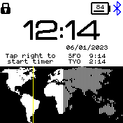
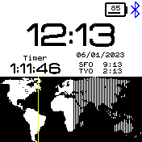

# Daylight World Clock

* Works with Bangle.js 2
* Other time zones
  *  Showing Paris and Tokyo by default, but you can customize this using the dedicated configuration page on the app store
* World Map
  *  The map shows day and night on Earth and the position of the Sun (yellow line)

 

## Creator
[@npbreland](https://github.com/npbreland)

Credit: This is a minor variation on A Clock Timer by
[@alainsaas](https://github.com/alainsaas)
